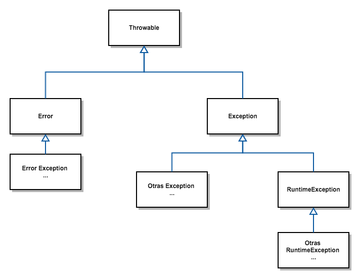

## Introducció a les Exceptions amb Java

Quan Java executa un codi i es troba amb una situació que no pot afrontar, o:
 - atura el programa
 - crea un tipus especial de dades, anomenada excepció, i que per descomptat, aquesta excepció és un objecte.

Ambdues accions són el llançament d'una Exception.
Podríem dir que es genera una excepció quan Java no té ni idea de què fer amb el nostre codi.

Què passa després?

L'excepció llançada espera que algú o alguna cosa s'ocupi d'ella;
si no ningú ho fa, el programa s'acabarà per la força i veureu un missatge d'error enviat a la consola;
en cas contrari, si es tracta i es gestiona correctament l'excepció, es pot reprendre el programa suspès i continuar amb la seva execució.

Java proporciona eines efectives que permeten observar excepcions,
identificar-les i gestionar-les de manera eficient. 
Això és possible pel fet que totes les possibles excepcions es poden classificar i 
s'hi pot reaccionar adequadament.

És possible que ja conegueu un missatge d'error d'excepció com el següent: [IndexOutOfBoundsException](https://docs.oracle.com/javase/8/docs/api/java/lang/IndexOutOfBoundsException.html)  

Però també teniu la possibilitat de crear les vostres pròpies excepcions, amb l'únic requisit que han de derivar de Exception.  

